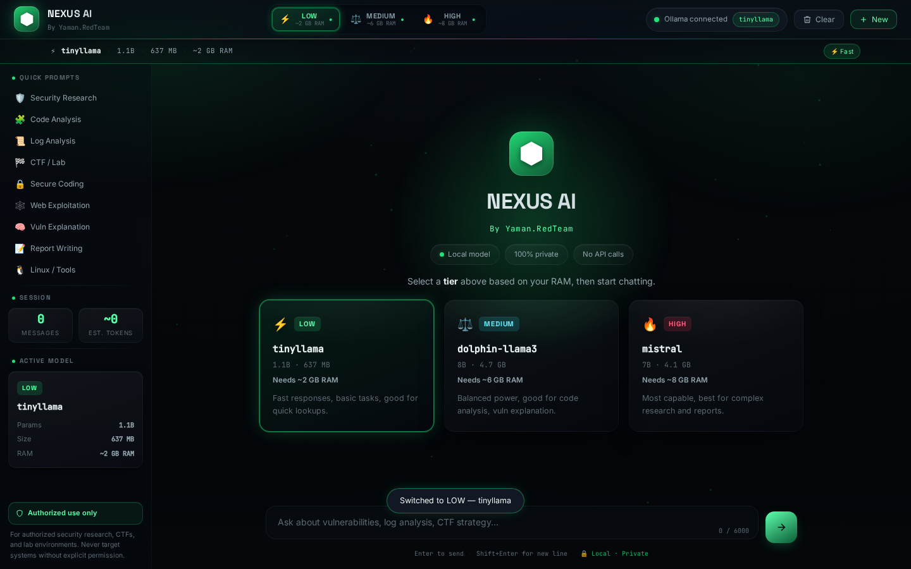
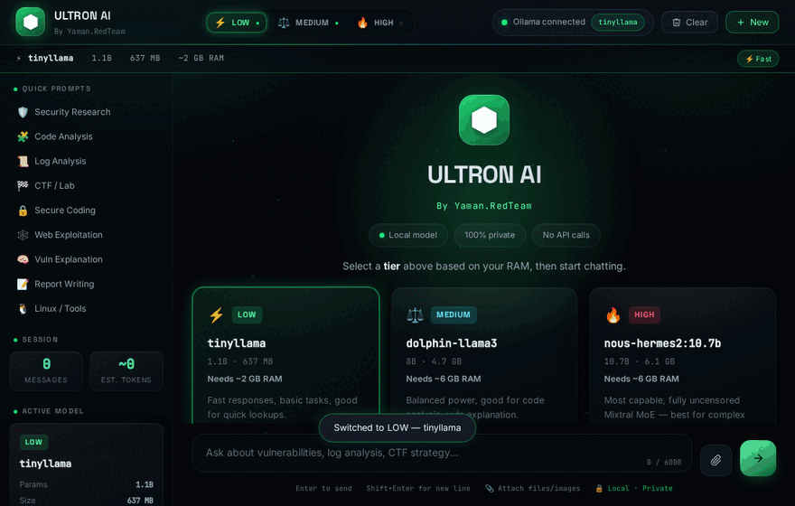
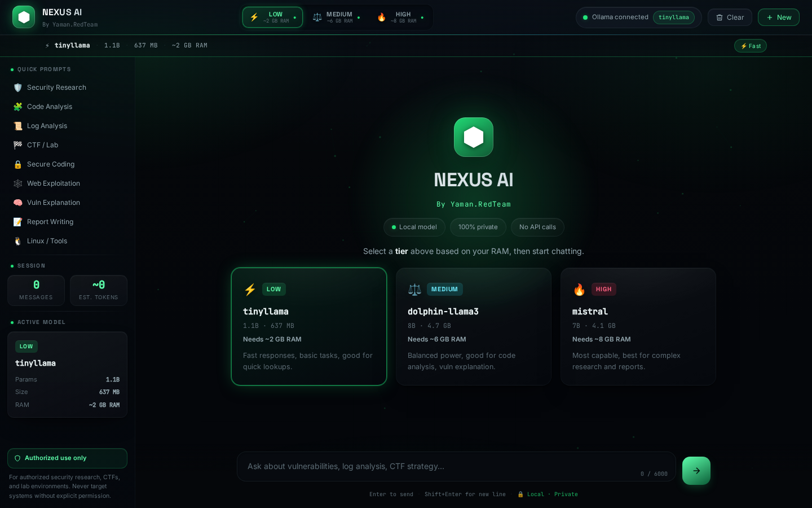
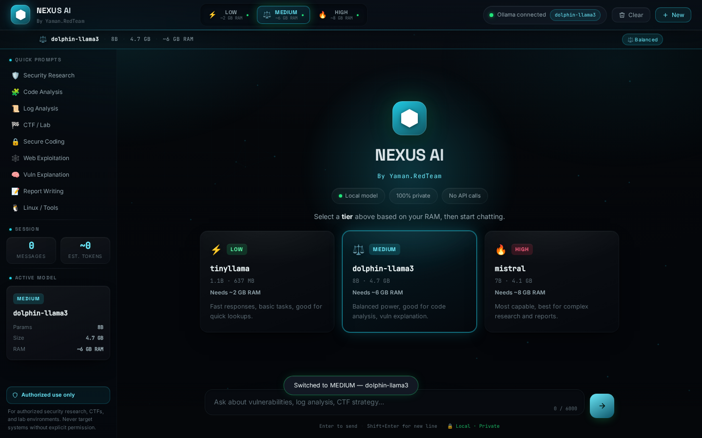
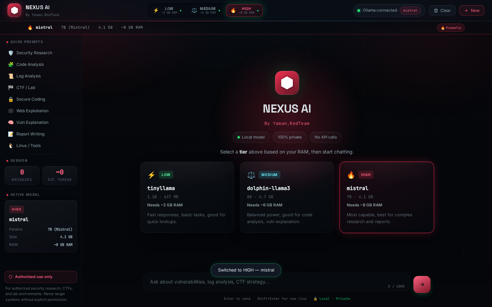
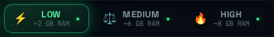
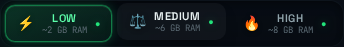

# NEXUS AI — By Yaman.RedTeam

A privacy-focused, locally-hosted AI assistant for cybersecurity learners and
researchers, built on **Python, FastAPI, and Ollama**. Everything runs
entirely on your own machine — prompts and responses never touch a
third-party API.


<p align="center">
  
</p>

---

## ✨ Highlights

- **3-tier model switcher** — pick a model to match your hardware: from a
  1.1 B featherweight to a 7B powerhouse.
- **Real-time streaming** — responses stream token-by-token via SSE, so the
  first word appears in ~1–2 s instead of waiting for full completion.
- **Dynamic UI theming** — switching tier recolors the *entire* interface:
  🟢 **LOW** · 🔵 **MEDIUM** · 🔴 **HIGH**, with a smooth 0.4 s color morph.
- **Live micro-interactions** — a theme-aware glow **pulse** on the active
  tier and a subtle **hover lift** on every button.
- **Live model availability** — the UI polls Ollama and shows, per tier,
  whether the model is pulled and ready (green ●) or not (dim ○).
- **100 % local & private** — no API keys, no telemetry, no outbound calls.
- **Rich chat rendering** — markdown, headings, lists, and copy-able fenced
  code blocks.
- **Honest error handling** — clear messages for "model not pulled",
  "not enough RAM", timeouts, and Ollama being offline.

---

## 🎬 Demo

Switching tier instantly recolors the **entire** interface — brand mark,
model bar, hero, and the active-tier glow pulse all morph together:

<p align="center">
  
</p>

---

## 🎨 The three tiers

| Tier | Model | Params | Size | Min RAM | Theme | Max tokens |
|------|-------|--------|------|---------|-------|-----------|
| ⚡ **LOW** | `tinyllama` | 1.1B | 637 MB | ~2 GB | 🟢 Green | 600 |
| ⚖️ **MEDIUM** | `dolphin-llama3` | 8B | 4.7 GB | ~6 GB | 🔵 Blue | 1200 |
| 🔥 **HIGH** | `mistral` | 7B | 4.1 GB | ~8 GB | 🔴 Red | 2048 |

> The active tier is sent per-request, so you can switch models mid-session
> without restarting anything.

---

## 🖼️ Themes in action

Each tier drives a full-UI accent theme — brand mark, model bar, active
button, tier card, send button, and message bubbles all recolor together.

<table>
  <tr>
    <td align="center"><b>🟢 LOW — tinyllama</b><br>
      </td>
    <td align="center"><b>🔵 MEDIUM — dolphin-llama3</b><br>
      </td>
  </tr>
  <tr>
    <td align="center"><b>🔴 HIGH — mistral</b><br>
      </td>
  </tr>
</table>

### Micro-interactions

<table>
  <tr>
    <td align="center"><b>Active-tier glow pulse</b><br>
      </td>
    <td align="center"><b>Hover lift</b><br>
      </td>
  </tr>
</table>

> 🎥 A short clip of the pulse recoloring across all three themes is included
> at [`screenshots/tier-pulse.webm`](screenshots/tier-pulse.webm).

---

## What this is

NEXUS AI wraps an uncensored/open local language model
(served through [Ollama](https://ollama.com)) in a clean FastAPI + web chat
interface, aimed at:

- Explaining cybersecurity concepts and vulnerability classes
- Reviewing code for security issues
- Analyzing logs and spotting anomalies
- Secure-coding guidance
- CTF and lab learning support
- Penetration-testing **methodology**, for authorized environments
- Reconnaissance **concepts** and tool documentation
- Explaining findings and writing security reports

This project is a learning/demo tool for **authorized** security research,
CTFs, and lab environments — not a tool for attacking systems you don't own
or have explicit permission to test.

## About the "uncensored" model

This project demonstrates running an uncensored/open local language model
through Ollama. Such models may provide fewer built-in refusals than
heavily safety-aligned commercial assistants, which is useful for direct,
jargon-free technical answers during security research. "Uncensored" does
**not** mean unlimited or all-knowing — it is still a language model that
can be wrong, and it should be used responsibly, only for authorized
security research, education, CTFs, and controlled lab environments.

## Architecture

```
User → NEXUS AI Web UI → FastAPI Backend ──────► Ollama API → Local LLM
                                  │  (tier → model)                  │
User ← NEXUS AI Web UI ◄─ SSE stream ◄──────── token chunks ◄─────┘
```

The `/api/chat` endpoint returns a **Server-Sent Events** stream. Each chunk
is a JSON line (`data: {"content": "token"}`), terminated by `data: [DONE]`.
The frontend uses `ReadableStream` to render tokens as they arrive, then
re-renders markdown on completion.

See [docs/Architecture.md](docs/Architecture.md) for the full component
breakdown, and [docs/Local_LLM_Setup_YamanRedTeam.pdf](docs/Local_LLM_Setup_YamanRedTeam.pdf)
for a complete setup and concepts guide.

## Project structure

```
Local-LLM-YamanRedTeam/
│
├── app.py                     # FastAPI backend — tiers, SSE streaming, errors
├── requirements.txt
├── run.sh                     # Starts Ollama (if needed) + the web app
│                              #   ./run.sh -d  → background via screen/nohup
├── README.md
├── .gitignore  ·  LICENSE  ·  .env.example
│
├── templates/
│   └── index.html             # Jinja2 chat UI (3-tier switcher, welcome)
│
├── static/
│   ├── css/style.css          # Dark theme + per-tier accent themes
│   ├── js/app.js              # SSE stream reader, theming, markdown renderer
│   └── assets/yamanredteam-logo.svg
│
├── docs/
│   ├── Architecture.md
│   └── Local_LLM_Setup_YamanRedTeam.pdf
│
└── screenshots/               # UI screenshots used in this README
```

## Requirements

- Linux (tested on Kali Linux), macOS (Intel + Apple Silicon), or Windows 10/11
- Python 3.10+
- [Ollama](https://ollama.com) installed and runnable
- Disk/RAM depending on the tier(s) you pull (see the table above)

## Setup (Linux / Kali Linux)

```bash
# 1. Install Ollama (skip if already installed)
curl -fsSL https://ollama.com/install.sh | sh

# 2. Clone the repo
git clone https://github.com/Yaman-RedTeam/Local-LLM-YamanRedTeam.git
cd Local-LLM-YamanRedTeam

# 3. Create and activate a virtual environment
python3 -m venv venv
source venv/bin/activate

# 4. Install Python dependencies
pip install -r requirements.txt

# 5. Copy the example environment file
cp .env.example .env        # edit if you want a different default tier/host/port

# 6. Pull the model(s) you want — one per tier you plan to use
ollama pull tinyllama          # LOW   (~2 GB RAM)
ollama pull dolphin-llama3     # MEDIUM (~6 GB RAM)
ollama pull mistral            # HIGH  (~8 GB RAM)
```

> You don't need all three — pull only the tiers your machine can run. The UI
> shows a dim ○ for any tier whose model isn't pulled yet.

## Setup (macOS)

**Prerequisites — install these first:**

| Tool | How |
|------|-----|
| Homebrew | `/bin/bash -c "$(curl -fsSL https://raw.githubusercontent.com/Homebrew/install/HEAD/install.sh)"` |
| Python 3.10+ | `brew install python` (or download from python.org) |
| Git | `brew install git` (or Xcode CLT: `xcode-select --install`) |
| Ollama | `brew install ollama` **or** download the `.dmg` from https://ollama.com/download/mac |

**Then in Terminal:**

```bash
# 1. Clone the repo
git clone https://github.com/Yaman-RedTeam/Local-LLM-YamanRedTeam.git
cd Local-LLM-YamanRedTeam

# 2. Create and activate a virtual environment
python3 -m venv venv
source venv/bin/activate

# 3. Install Python dependencies
pip install -r requirements.txt

# 4. Copy the example environment file
cp .env.example .env

# 5. Pull the model(s) you want
ollama pull tinyllama          # LOW   (~2 GB RAM)
ollama pull dolphin-llama3     # MEDIUM (~6 GB RAM)
ollama pull mistral            # HIGH  (~8 GB RAM)
```

> **Apple Silicon (M1/M2/M3):** Ollama runs natively on ARM — models run
> significantly faster than on Intel Macs. No extra setup needed.
>
> **Ollama as a .dmg app:** it starts automatically on login and runs in the
> menu bar. If installed via Homebrew, start it manually: `ollama serve`.

## Setup (Windows 10 / 11)

**Prerequisites — install these first:**

| Tool | Download |
|------|----------|
| Python 3.10+ | https://www.python.org/downloads/ — tick **"Add python.exe to PATH"** during install |
| Git | https://git-scm.com/download/win |
| Ollama | https://ollama.com/download/windows — run the `.exe` installer |

**Then in PowerShell or Command Prompt:**

```powershell
# 1. Clone the repo
git clone https://github.com/Yaman-RedTeam/Local-LLM-YamanRedTeam.git
cd Local-LLM-YamanRedTeam

# 2. Create and activate a virtual environment
python -m venv venv
venv\Scripts\activate

# 3. Install Python dependencies
pip install -r requirements.txt

# 4. Copy the example environment file
copy .env.example .env

# 5. Pull the model(s) you want
ollama pull tinyllama          # LOW   (~2 GB RAM)
ollama pull dolphin-llama3     # MEDIUM (~6 GB RAM)
ollama pull mistral            # HIGH  (~8 GB RAM)
```

> Ollama on Windows starts automatically in the system tray after installation.
> If it's not running, search for **Ollama** in the Start menu and launch it.

## Running the app

### Linux / macOS

Option A — the helper script (starts Ollama if it isn't running, then the web app):

```bash
./run.sh          # foreground — logs to terminal
./run.sh -d       # background — via screen (reattach: screen -r llm-server)
                  #              or nohup if screen isn't installed
```

Option B — manual:

```bash
ollama serve &          # if not already running
source venv/bin/activate
uvicorn app:app --host 0.0.0.0 --port 8000
```

### Windows

```powershell
# Make sure Ollama is running (system tray icon)
venv\Scripts\activate
uvicorn app:app --host 0.0.0.0 --port 8000
```

Then open **http://localhost:8000** in your browser.

## Configuration

All configuration is via environment variables (see `.env.example`):

| Variable                  | Default                     | Purpose                                     |
|---------------------------|-----------------------------|---------------------------------------------|
| `OLLAMA_HOST`             | `http://localhost:11434`    | Ollama API base URL                         |
| `DEFAULT_TIER`            | `low`                       | Tier selected on first load                 |
| `APP_HOST` / `APP_PORT`   | `0.0.0.0` / `8000`          | FastAPI bind address                        |
| `REQUEST_TIMEOUT_SECONDS` | `300`                       | Timeout for a single Ollama generation      |
| `MAX_MESSAGE_LENGTH`      | `6000`                      | Max characters per chat message             |
| `MAX_HISTORY_MESSAGES`    | `40`                        | Max messages kept in one conversation       |

The tier → model map lives in `app.py` (`MODELS`); swap in any compatible
Ollama model and `ollama pull` it.

## API

| Method & path | Purpose |
|---------------|---------|
| `GET /` | Chat UI |
| `GET /api/health` | Liveness check for the web service |
| `GET /api/status` | Ollama connectivity + default-model availability |
| `GET /api/models` | Per-tier info + **live availability** for every tier |
| `POST /api/chat` | Send a conversation — returns an SSE stream |

**`POST /api/chat`** — request body:

```json
{
  "messages": [{ "role": "user", "content": "Explain SSRF briefly." }],
  "tier": "high"
}
```

Response — `text/event-stream` (Server-Sent Events):

```
data: {"content": "SSRF"}
data: {"content": " (Server"}
data: {"content": "-Side"}
...
data: [DONE]
```

Each `data:` line carries one token chunk. On error:

```
data: {"error": "Model 'mistral' not installed. Run: ollama pull mistral"}
```

`tier` is optional and defaults to `DEFAULT_TIER`. Interactive API docs are
served at **`/api/docs`**.

## Troubleshooting

- **"Could not reach the backend"** — the FastAPI server isn't running.
  Start it with `./run.sh` or `./run.sh -d` for background mode.
- **"Ollama offline" / SSE error from `/api/chat`** — make sure `ollama serve` is
  running and reachable at `OLLAMA_HOST`.
- **"Model not pulled" (dim ○ on a tier)** — run `ollama pull <model>` for
  that tier (see the table above).
- **"Not enough RAM to load ..."** — the tier's model is larger than your
  free RAM. Switch to a lower tier.
- **Slow first response on HIGH (mistral)** — the first request loads model
  weights into RAM (or swap); streaming means you'll see the first token as
  soon as generation starts, even if loading takes 30–90 s on a CPU-only box.
  Subsequent requests are faster once the model is warm.
- **Port already in use** — change `APP_PORT` in `.env`.
- **macOS: `python3` not found** — run `brew install python` or install from
  python.org; macOS ships an alias but not the full interpreter.
- **macOS: `ollama` command not found after .dmg install** — the .dmg app
  doesn't add `ollama` to PATH; use `brew install ollama` instead, or start
  Ollama from the menu bar and use `ollama pull` from a new Terminal window.
- **Windows: `venv\Scripts\activate` not recognized** — open PowerShell as
  Administrator and run `Set-ExecutionPolicy RemoteSigned`, then try again.
- **Windows: `python` not found** — reinstall Python and make sure
  **"Add python.exe to PATH"** is ticked, or use `py` instead of `python`.

## Responsible use

This project is intended for:

- Systems and networks **you own**, or
- Systems and networks you have **explicit written authorization** to test
  (CTFs, labs, and scoped engagements)

Do not use this project, or any content it generates, against systems you
do not own or are not authorized to test. You are responsible for complying
with all applicable laws and the terms of any engagement you work under.

## License

MIT — see [LICENSE](LICENSE).

---

Built by **Yaman.RedTeam**.
