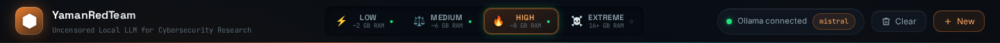
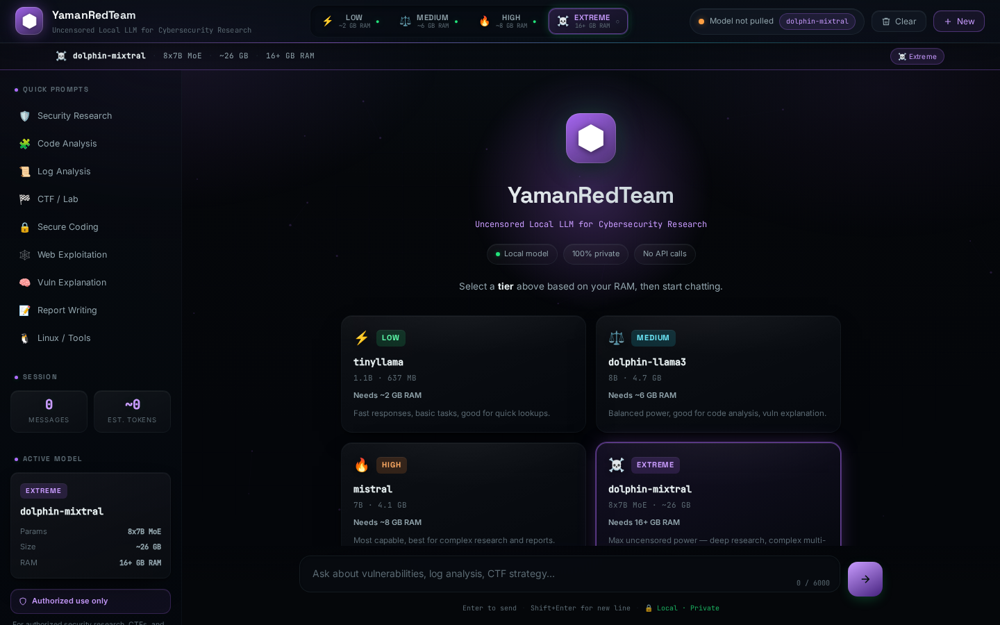

# YamanRedTeam — Uncensored Local LLM for Cybersecurity Research

A privacy-focused, locally-hosted AI assistant for cybersecurity learners and
researchers, built on **Python, FastAPI, and Ollama**. Everything runs
entirely on your own machine — prompts and responses never touch a
third-party API.


<p align="center">
  
</p>

---

## ✨ Highlights

- **4-tier model switcher** — pick a model to match your hardware, from a
  1.1 B featherweight to an uncensored 8×7B MoE powerhouse.
- **Dynamic UI theming** — switching tier recolors the *entire* interface:
  🟢 **LOW** · 🔵 **MEDIUM** · 🔴 **HIGH** · 🟣 **EXTREME**, with a smooth
  0.4 s color morph.
- **Live micro-interactions** — a theme-aware glow **pulse** on the active
  tier and a subtle **hover lift** on every button.
- **Live model availability** — the UI polls Ollama and shows, per tier,
  whether the model is pulled and ready (green ●) or not (dim ○).
- **100 % local & private** — no API keys, no telemetry, no outbound calls.
- **Rich chat rendering** — markdown, headings, lists, and copy-able fenced
  code blocks.
- **Honest error handling** — clear messages for "model not pulled",
  "not enough RAM", timeouts, and Ollama being offline.

---

## 🎨 The four tiers

| Tier | Model | Params | Size | Min RAM | Theme |
|------|-------|--------|------|---------|-------|
| ⚡ **LOW** | `tinyllama` | 1.1B | 637 MB | ~2 GB | 🟢 Green |
| ⚖️ **MEDIUM** | `dolphin-llama3` | 8B | 4.7 GB | ~6 GB | 🔵 Blue |
| 🔥 **HIGH** | `mistral` | 7B | 4.1 GB | ~8 GB | 🔴 Red |
| ☠️ **EXTREME** | `dolphin-mixtral` | 8×7B MoE | ~26 GB | 16+ GB | 🟣 Purple |

> The active tier is sent per-request, so you can switch models mid-session
> without restarting anything.

<p align="center">
  
</p>

---

## 🖼️ Themes in action

Each tier drives a full-UI accent theme — brand mark, model bar, active
button, tier card, send button, and message bubbles all recolor together.

<table>
  <tr>
    <td align="center"><b>🟢 LOW — tinyllama</b><br>
      </td>
    <td align="center"><b>🔵 MEDIUM — dolphin-llama3</b><br>
      </td>
  </tr>
  <tr>
    <td align="center"><b>🔴 HIGH — mistral</b><br>
      </td>
    <td align="center"><b>🟣 EXTREME — dolphin-mixtral</b><br>
      </td>
  </tr>
</table>

### Micro-interactions

<table>
  <tr>
    <td align="center"><b>Active-tier glow pulse</b><br>
      </td>
    <td align="center"><b>Hover lift</b><br>
      </td>
  </tr>
</table>

> 🎥 A short clip of the pulse recoloring across all four themes is included
> at [`screenshots/tier-pulse.webm`](screenshots/tier-pulse.webm).

---

## What this is

YamanRedTeam Local LLM wraps an uncensored/open local language model
(served through [Ollama](https://ollama.com)) in a clean FastAPI + web chat
interface, aimed at:

- Explaining cybersecurity concepts and vulnerability classes
- Reviewing code for security issues
- Analyzing logs and spotting anomalies
- Secure-coding guidance
- CTF and lab learning support
- Penetration-testing **methodology**, for authorized environments
- Reconnaissance **concepts** and tool documentation
- Explaining findings and writing security reports

This project is a learning/demo tool for **authorized** security research,
CTFs, and lab environments — not a tool for attacking systems you don't own
or have explicit permission to test.

## About the "uncensored" model

This project demonstrates running an uncensored/open local language model
through Ollama. Such models may provide fewer built-in refusals than
heavily safety-aligned commercial assistants, which is useful for direct,
jargon-free technical answers during security research. "Uncensored" does
**not** mean unlimited or all-knowing — it is still a language model that
can be wrong, and it should be used responsibly, only for authorized
security research, education, CTFs, and controlled lab environments.

## Architecture

```
User → YamanRedTeam Web UI → FastAPI Backend → Ollama API → Local LLM
                                    │  (tier → model)
User ← YamanRedTeam Web UI ← FastAPI Backend ←─────────────┘
```

See [docs/Architecture.md](docs/Architecture.md) for the full component
breakdown, and [docs/Local_LLM_Setup_YamanRedTeam.pdf](docs/Local_LLM_Setup_YamanRedTeam.pdf)
for a complete setup and concepts guide.

## Project structure

```
Local-LLM-YamanRedTeam/
│
├── app.py                     # FastAPI backend — tiers, chat, error handling
├── requirements.txt
├── run.sh                     # Starts Ollama (if needed) + the web app
├── README.md
├── .gitignore  ·  LICENSE  ·  .env.example
│
├── templates/
│   └── index.html             # Jinja2 chat UI (4-tier switcher, welcome)
│
├── static/
│   ├── css/style.css          # Dark theme + per-tier accent themes
│   ├── js/app.js              # Chat logic, theming, safe DOM rendering
│   └── assets/yamanredteam-logo.svg
│
├── docs/
│   ├── Architecture.md
│   └── Local_LLM_Setup_YamanRedTeam.pdf
│
└── screenshots/               # UI screenshots used in this README
```

## Requirements

- Linux (tested on Kali Linux) or macOS/WSL2
- Python 3.10+
- [Ollama](https://ollama.com) installed and runnable
- Disk/RAM depending on the tier(s) you pull (see the table above)

## Setup (Linux / Kali Linux)

```bash
# 1. Install Ollama (skip if already installed)
curl -fsSL https://ollama.com/install.sh | sh

# 2. Clone the repo
git clone https://github.com/Yaman-RedTeam/Local-LLM-YamanRedTeam.git
cd Local-LLM-YamanRedTeam

# 3. Create and activate a virtual environment
python3 -m venv venv
source venv/bin/activate

# 4. Install Python dependencies
pip install -r requirements.txt

# 5. Copy the example environment file
cp .env.example .env        # edit if you want a different default tier/host/port

# 6. Pull the model(s) you want — one per tier you plan to use
ollama pull tinyllama          # LOW
ollama pull dolphin-llama3     # MEDIUM
ollama pull mistral            # HIGH
ollama pull dolphin-mixtral    # EXTREME  (needs 16+ GB RAM)
```

> You don't need all four — pull only the tiers your machine can run. The UI
> shows a dim ○ for any tier whose model isn't pulled yet.

## Running the app

Option A — the helper script (starts Ollama if it isn't running, then the web app):

```bash
./run.sh
```

Option B — manual:

```bash
ollama serve &          # if not already running
source venv/bin/activate
uvicorn app:app --host 0.0.0.0 --port 8000
```

Then open **http://localhost:8000**.

## Configuration

All configuration is via environment variables (see `.env.example`):

| Variable                  | Default                     | Purpose                                     |
|---------------------------|-----------------------------|---------------------------------------------|
| `OLLAMA_HOST`             | `http://localhost:11434`    | Ollama API base URL                         |
| `DEFAULT_TIER`            | `low`                       | Tier selected on first load                 |
| `APP_HOST` / `APP_PORT`   | `0.0.0.0` / `8000`          | FastAPI bind address                        |
| `REQUEST_TIMEOUT_SECONDS` | `300`                       | Timeout for a single Ollama generation      |
| `MAX_MESSAGE_LENGTH`      | `6000`                      | Max characters per chat message             |
| `MAX_HISTORY_MESSAGES`    | `40`                        | Max messages kept in one conversation       |

The tier → model map lives in `app.py` (`MODELS`); swap in any compatible
Ollama model and `ollama pull` it.

## API

| Method & path | Purpose |
|---------------|---------|
| `GET /` | Chat UI |
| `GET /api/health` | Liveness check for the web service |
| `GET /api/status` | Ollama connectivity + default-model availability |
| `GET /api/models` | Per-tier info + **live availability** for every tier |
| `POST /api/chat` | Send a conversation and get a reply |

**`POST /api/chat`** — request body:

```json
{
  "messages": [{ "role": "user", "content": "Explain SSRF briefly." }],
  "tier": "high"
}
```

Response:

```json
{ "role": "assistant", "content": "...", "model": "mistral", "tier": "high" }
```

`tier` is optional and defaults to `DEFAULT_TIER`. Interactive API docs are
served at **`/api/docs`**.

## Troubleshooting

- **"Ollama offline" / 503 from `/api/chat`** — make sure `ollama serve` is
  running and reachable at `OLLAMA_HOST`.
- **"Model not pulled" (dim ○ on a tier)** — run `ollama pull <model>` for
  that tier (see the table above).
- **"Not enough RAM to load ..." (507)** — the tier's model is larger than
  your free RAM. Switch to a lower tier. (EXTREME / `dolphin-mixtral` needs
  16+ GB.)
- **Slow first response** — the first request after starting Ollama loads
  model weights into memory; later requests are faster. Larger models are
  much slower on CPU-only machines.
- **Port already in use** — change `APP_PORT` in `.env`.

## Responsible use

This project is intended for:

- Systems and networks **you own**, or
- Systems and networks you have **explicit written authorization** to test
  (CTFs, labs, and scoped engagements)

Do not use this project, or any content it generates, against systems you
do not own or are not authorized to test. You are responsible for complying
with all applicable laws and the terms of any engagement you work under.

## License

MIT — see [LICENSE](LICENSE).

---

Built independently by **YamanRedTeam**.
